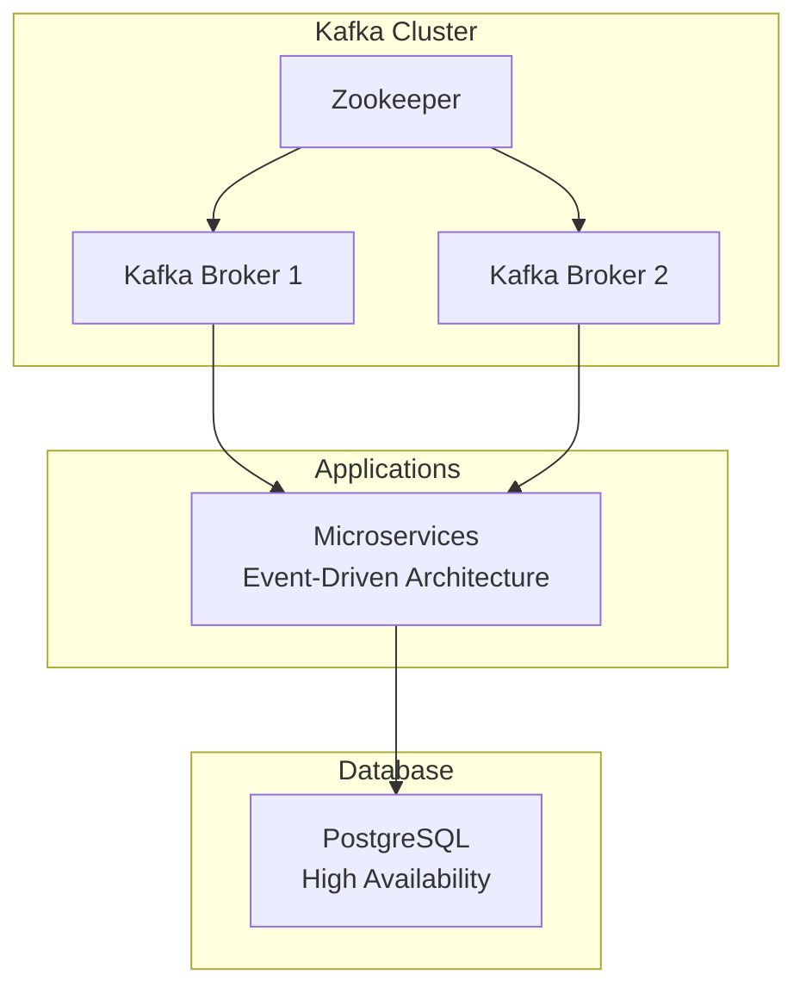

# Kafka + PostgreSQL High-Availability Setup

This repository demonstrates a resilient setup for running **Kafka** (message broker) with **PostgreSQL** database using Docker Compose.  
It reflects real-world configurations I have worked with in banking environments for event-driven microservices and reliable data processing.

### What This Demonstrates
- Kafka cluster with Zookeeper for coordination
- PostgreSQL with persistent storage
- Basic high-availability and replication concepts
- Easy local testing with Docker Compose
- Ready-to-adapt structure for Kubernetes deployment

### Tech Stack
- Kafka
- Zookeeper
- PostgreSQL
- Docker Compose
- (Optional) Kubernetes manifests

### Files Included
- `docker-compose.yml` — Complete local HA-style setup
- `kafka-config.yml` — Basic Kafka configuration
- `postgres-init.sql` — Sample database initialization script

### Quick Start
```bash
docker-compose up -d
```
Kafka UI / Broker
```bash
http://localhost:9092
```
PostgreSQL
```bash
localhost:5432
# (user: postgres, password: example)
```

## Real-World Application
I have implemented similar Kafka + PostgreSQL setups in production banking systems to handle event streaming, reliable messaging, and persistent data storage with high uptime requirements.
This architecture supports scalable microservices and ensures data durability across failures.


