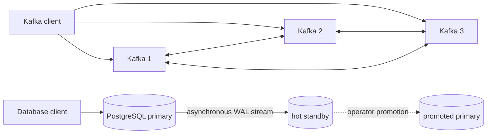

# Kafka Quorum and PostgreSQL Replication Lab

[](https://github.com/natnaela-devops/kafka-postgres-ha-setup/actions/workflows/validate.yml)

A reproducible Docker Compose lab for practicing distributed-system health checks, Kafka quorum behavior, PostgreSQL streaming replication, and controlled failure drills.

The repository name predates this revision. The implementation is intentionally precise about its boundary: Kafka is configured as a three-node replicated KRaft cluster; PostgreSQL has a primary and hot standby with asynchronous streaming replication. PostgreSQL promotion is operator-driven, so this is not presented as an automatically failing-over production database platform.

## What the automated workflow proves

- all three Kafka nodes form a KRaft controller quorum
- the `banking-events` topic has three partitions, replication factor three, and minimum ISR two
- a unique event can be produced and consumed through different brokers
- PostgreSQL initializes a physical replication slot and the standby remains in recovery
- a primary write becomes visible on the hot standby
- Kafka continues producing and consuming during a controlled one-broker outage

## Architecture


```mermaid
flowchart LR
    Client[Kafka client] --> K1[Kafka 1]
    Client --> K2[Kafka 2]
    Client --> K3[Kafka 3]
    K1 <--> K2
    K2 <--> K3
    K3 <--> K1

    App[Database client] --> Primary[(PostgreSQL primary)]
    Primary -->|asynchronous WAL stream| Standby[(hot standby)]
    Standby -. operator promotion .-> Promoted[(promoted primary)]
```

## Stack

- Apache Kafka 4.1.2 using the official JVM image and KRaft mode
- PostgreSQL 17 using the official image and native physical streaming replication
- Docker Compose
- Bash verification and failure-drill scripts
- GitHub Actions runtime validation

## Requirements

- Docker Engine 20.10.4 or newer
- Docker Compose v2
- approximately 4 GB of available memory for a comfortable local run

## Quick start

```bash
cp .env.example .env
make config
make up
make bootstrap
make verify
```

Host access points:

| Service | Address | Purpose |
|---|---|---|
| Kafka 1 | `localhost:29092` | host client bootstrap |
| Kafka 2 | `localhost:39092` | host client bootstrap |
| Kafka 3 | `localhost:49092` | host client bootstrap |
| PostgreSQL primary | `localhost:5432` | reads and writes |
| PostgreSQL standby | `localhost:5433` | read-only verification |

The credentials in `.env.example` are disposable local-lab values. `.env` is ignored. Real credentials belong in an approved secret manager and Kafka production traffic requires authentication, authorization, and TLS.

## Failure drill

```bash
make drill
```

The drill stops one Kafka broker, verifies the replicated topic through the remaining brokers, and restarts the stopped broker. PostgreSQL promotion is documented separately because promotion changes the database timeline and requires a deliberate rejoin procedure.

See [the operations runbook](docs/operations-runbook.md) for health checks, failure semantics, promotion steps, recovery cautions, and cleanup.

## Repository layout

```text
.
├── .github/workflows/validate.yml
├── docs/operations-runbook.md
├── postgres/
│   ├── primary-init/00-replication.sh
│   └── standby/standby-entrypoint.sh
├── scripts/
│   ├── bootstrap.sh
│   ├── kafka-failure-drill.sh
│   └── verify.sh
├── .env.example
├── docker-compose.yml
└── Makefile
```

## Evidence boundaries

This is a local resilience lab, not evidence of a production SLA. It does not claim zero downtime, a measured RPO/RTO, automatic PostgreSQL failover, cross-zone placement, encrypted listeners, backup restore validation, or production load capacity.

A production design would additionally require dedicated Kafka controllers/brokers as scale demands, TLS/SASL and ACLs, secrets management, multi-zone placement, monitoring and alerting, tested backup/PITR, an automated PostgreSQL HA manager or managed service, connection routing, capacity tests, and repeated disaster-recovery evidence.

## References

- [Apache Kafka official Docker image guide](https://kafka.apache.org/41/getting-started/docker/)
- [PostgreSQL streaming replication documentation](https://www.postgresql.org/docs/17/warm-standby.html)
- [PostgreSQL hot standby documentation](https://www.postgresql.org/docs/17/hot-standby.html)

## License

MIT

